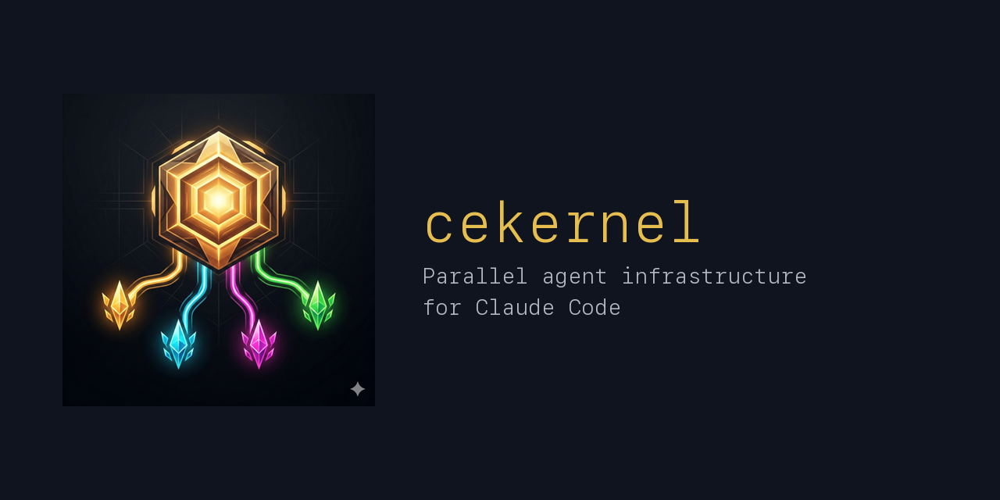

# cekernel



Parallel agent infrastructure for Claude Code. Modeled after the OS process model,
it distributes, monitors, and reaps issues via independent Workers.

## Concept

```
Orchestrator (agent1)             Worker (agent2, 3, 4, ...)
  main working tree                 git worktree per issue
  +---------------+               +---------------+
  | receive issue |               | implement     |
  | create wktree |--spawn------->| test          |
  | monitor FIFO  |               | create PR     |
  |   ...waiting  |               | CI verify     |
  |   <--signal---|<--notify------| notify done   |
  | review (agent)|               +---------------+
  | merge / human |
  | cleanup       |
  +---------------+
```

### OS Analogy

| OS | kernel |
|----|--------|
| `init` / scheduler | Orchestrator |
| process | Worker |
| `fork` + `exec` | `spawn-worker.sh` |
| address space | git worktree |
| process states | `worker-state.sh` (NEW/RUNNING/WAITING/SUSPENDED/TERMINATED) |
| `nice` / priority | `--priority` flag + `worker-priority.sh` |
| IPC pipe | named pipe (FIFO) |
| IPC namespace | session (`CEKERNEL_SESSION_ID`) |
| SIGTERM | `send-signal.sh TERM` |
| SIGSTOP / SIGCONT | `send-signal.sh SUSPEND` / `spawn-worker.sh --resume` |
| SIGKILL | `cleanup-worktree.sh --force` |
| SIGALRM / watchdog | `CEKERNEL_WORKER_TIMEOUT` + escalation (TERM → grace → force-kill) |
| `waitpid` | `watch-worker.sh` (triple-path: FIFO + state file + crash detection) |
| zombie reaping | `health-check.sh` + `cleanup-worktree.sh` |
| core dump / checkpoint | `.cekernel-checkpoint.md` (suspend/resume) |
| `systemctl` | `orchctrl.sh` / `/orchctrl` skill |
| device drivers | `backend-adapter.sh` (wezterm/tmux/headless) |
| `/etc/default/` | `load-env.sh` + env profiles |
| PID | issue number |
| `/var/log/` | `${CEKERNEL_IPC_DIR}/logs/` |
| `syslog` | Lifecycle event log writes |
| `tail -f` / `journalctl` | `watch-logs.sh` |
| log rotation | Logs deleted by `cleanup-worktree.sh` |
| page cache | `.cekernel-task.md` (issue data pre-extracted at spawn) |
| `ulimit -u` (max processes) | `CEKERNEL_MAX_WORKERS` |
| `ps aux` | `worker-status.sh` |
| process scheduler | Orchestrator queuing logic (priority queue + preemption) |
| semaphore | Concurrency guard via FIFO count |
| `flock` / mutex | `issue-lock.sh` (repo × issue lockfile) |
| `cron` / `systemd timer` | `/cron` skill + OS-native schedulers (launchd/crontab) |
| `at` (one-shot job) | `/at` skill + OS-native schedulers (launchd/atd) |
| `/var/` | `/usr/local/var/cekernel/` (runtime state) |

For details on logging, IPC, and resource governance, see [internals.md](./docs/internals.md).

## Structure

```
.claude-plugin/
  plugin.json              # Plugin manifest
agents/
  orchestrator.md          # Orchestrator protocol definition
  worker.md                # Worker protocol definition
  reviewer.md              # Reviewer protocol definition (Orchestrator subagent)
  probe.md                 # Namespace detection diagnostic agent
Makefile                   # Runtime directory setup (make install)
config/
  Makefile                 # WezTerm plugin install/uninstall
  README.md                # WezTerm backend setup guide
  wezterm.cekernel.lua     # WezTerm plugin (Worker layout via user-var event)
docs/
  adr/                     # Architecture Decision Records
  claude-code-constraints.md  # Claude Code platform constraints reference
  internals.md             # Logging, IPC, resource governance details
  tdd.md                   # Test-driven development guide
  unix-philosophy.md       # UNIX philosophy reference
skills/
  dispatch/
    SKILL.md               # /dispatch skill — batch-process ready-labeled issues
  orchctrl/
    SKILL.md               # /orchctrl skill — Worker control interface
  orchestrate/
    SKILL.md               # /orchestrate skill — issue delegation
  probe/
    SKILL.md               # /probe skill — namespace detection diagnostic
  cron/
    SKILL.md               # /cron skill — recurring schedule management
  at/
    SKILL.md               # /at skill — one-shot schedule management
  unix-architect/
    SKILL.md               # /unix-architect skill — ADR authoring and review
  references/
    namespace-detection.md # Canonical namespace detection logic
    triage.md              # Canonical issue triage protocol
envs/
  README.md                # Environment variable catalog
  default.env              # Default profile (wezterm, 3 workers)
  headless.env             # Headless profile (headless, 5 workers)
  ci.env                   # CI profile (headless, 1800s timeout)
scripts/
  orchestrator/
    spawn-worker.sh        # Create worktree + launch Worker via backend (with concurrency guard)
    watch-worker.sh        # Monitor Worker completion (FIFO + state file + crash detection)
    watch-logs.sh          # Real-time Worker log monitoring
    cleanup-worktree.sh    # Remove worktree + branch + logs
    health-check.sh        # Detect zombie Workers
    worker-status.sh       # List active Workers
    orchctrl.sh            # Worker control interface (systemctl for cekernel)
    send-signal.sh         # Send signal (TERM/SUSPEND) to a running Worker
  worker/
    notify-complete.sh     # Worker → Orchestrator completion notification
    check-signal.sh        # Check for pending signal (Worker-side)
  shared/
    session-id.sh          # Session ID generation + IPC directory derivation
    claude-json-helper.sh  # ~/.claude.json trust entry read/write helper
    backend-adapter.sh     # Backend abstraction layer (wezterm/tmux/headless)
    task-file.sh           # Local task file extraction (session memory: page cache)
    load-env.sh            # Environment profile loader (multi-layer search)
    checkpoint-file.sh     # Checkpoint file helpers for suspend/resume
    worker-priority.sh     # Worker priority (nice value) management
    worker-state.sh        # Worker process state management
    issue-lock.sh          # Repo × issue lockfile (duplicate Worker prevention)
    backends/
      headless.sh          # Headless backend implementation
      tmux.sh              # tmux backend implementation
      wezterm.sh           # WezTerm backend implementation
  scheduler/
    registry.sh            # Schedule registry CRUD
    wrapper.sh             # Runner script generator
    resolve-api-key.sh     # API key dynamic resolution
    preflight.sh           # Registration preflight checks
    cron.sh                # /cron command handler (register/list/cancel)
    cron-backend.sh        # Cron backend adapter (launchd/crontab)
    cron-backends/
      launchd.sh           # macOS launchd backend (plist + cron expr parser)
      crontab.sh           # Linux/WSL crontab backend
    at.sh                  # /at command handler (register/list/cancel)
    at-backend.sh          # At backend adapter (launchd/atd)
    at-backends/
      launchd.sh           # macOS launchd backend (plist + one-shot cleanup)
      atd.sh               # Linux/WSL atd backend
tests/
  run-tests.sh             # Test runner
  helpers.sh               # Assertion helpers
  orchestrator/test-*.sh   # Orchestrator script tests
  worker/test-*.sh         # Worker script tests
  shared/test-*.sh         # Shared helper tests
  scheduler/test-*.sh      # Scheduler script tests
```

## Dependencies

| Tool | Purpose | Required |
|------|---------|----------|
| [Claude Code](https://docs.anthropic.com/en/docs/claude-code) | Runtime for Worker agents | Yes |
| [jq](https://jqlang.github.io/jq/) | `~/.claude.json` trust entry manipulation, JSON parsing | Yes |
| [gh](https://cli.github.com/) | Issue retrieval, PR creation/merge | Yes |
| [WezTerm](https://wezfurlong.org/wezterm/) | Worker window launch/management (wezterm backend) | No* |
| [tmux](https://github.com/tmux/tmux) | Worker pane management (tmux backend) | No* |
| git | Worktree creation/management | Yes |

\* One backend is required: WezTerm (default), tmux, or headless. Set `CEKERNEL_BACKEND` env var to select. Headless requires no terminal.

## How to Use

### Prerequisites & Notes

cekernel is primarily designed for **monorepo** structures. While it may work with other setups, monorepo is the tested and expected configuration.

**Recommended for target repositories:**

- CI should be set up (unit tests, integration tests, e2e tests). Workers rely on CI to verify their changes.
- CD (continuous deployment) is optional — cekernel only handles the implement → PR → CI → review → merge lifecycle.

**Backend support:**

| Backend | Status |
|---------|--------|
| WezTerm | Stable |
| Headless | Stable |
| tmux | Stable |

**Scheduler backend support:**

| Backend | Platform | Status |
|---------|----------|--------|
| launchd | macOS | Verified — `/cron` and `/at` tested on macOS with real launchd execution |
| crontab | Linux/WSL | Untested — unit tests pass, but no live execution verification yet |
| atd | Linux/WSL | Untested — unit tests pass, but no live execution verification yet |

**Cross-repository issues:** If you manage issues in a separate meta-repository, pass the full path or URL to `/orchestrate`:

```bash
/cekernel:orchestrate /org/repo/issues/123
# or
/cekernel:orchestrate https://github.com/org/repo/issues/123
```

> **Note**: Cross-repository issue resolution has not been extensively tested. Please [open an issue](https://github.com/clonable-eden/cekernel/issues/new) if you encounter any problems.

Issues and feedback are always welcome.

### Install

Install from the Claude Code plugin marketplace:

```bash
# 1. Add marketplace
/plugin marketplace add clonable-eden/plugins

# 2. Install cekernel plugin
/plugin install cekernel@clonable-eden-plugins
```

### Runtime Setup

Set up the runtime state directory for scheduled execution:

```bash
# Create /usr/local/var/cekernel/ (one-time)
sudo mkdir -p /usr/local/var/cekernel && sudo chown $(whoami):admin /usr/local/var/cekernel

# Initialize directory structure
make install
```

This creates `ipc/`, `locks/`, `logs/`, `runners/`, and `schedules.json` under `/usr/local/var/cekernel/`. Required for `/cron`, `/at` skills and IPC.

### Update

```bash
# 1. Update marketplace repository
/plugin marketplace update

# 2. Update plugin
/plugin update

# 3. Restart Claude Code to apply
```

> **Note**: `/plugin update` alone may not update the marketplace local clone.
> Always run `/plugin marketplace update` first.

### First Steps

1. **Create a `.gitignore` issue** — Add `.worktrees` and `.cekernel*` to your repository's `.gitignore`. Create a GitHub issue for this task.

2. **Let cekernel close it** — Start Claude Code and run:

   ```bash
   /cekernel:orchestrate <issue-number>
   ```

   Use `--env` to select your preferred backend (e.g., `--env headless`). This will spawn a Worker that implements the change, creates a PR, and verifies CI.

This gives you a quick end-to-end verification that cekernel is working correctly in your repository.

## Configuration

cekernel is configured via `CEKERNEL_*` environment variables. See [`envs/README.md`](./envs/README.md) for the full catalog.

Named profiles (`.env` files) provide coherent sets of defaults for common scenarios:

| Profile | Use case |
|---------|----------|
| `default.env` | Local development with WezTerm |
| `headless.env` | Terminal-free execution (CI, cron) |
| `ci.env` | CI-specific settings |

Select a profile via `CEKERNEL_ENV`:

```bash
export CEKERNEL_ENV=headless   # default: "default"
```

Profiles are loaded with multi-layer priority (lowest → highest):

1. Script defaults (`${VAR:-default}`)
2. Plugin profile (`envs/${CEKERNEL_ENV}.env`)
3. Project override (`.cekernel/envs/${CEKERNEL_ENV}.env`)
4. Explicit environment variables

Projects can override plugin defaults by placing `.env` files in `.cekernel/envs/`. These survive `/plugin update`. See [ADR-0006](./docs/adr/0006-env-var-catalog-and-profiles.md) for design details.

If using the WezTerm backend, see [`config/README.md`](./config/README.md) for plugin setup.

## Usage

| Skill | Purpose |
|-------|---------|
| `/orchestrate` | Issue delegation and parallel processing |
| `/dispatch` | Batch-process ready-labeled issues |
| `/orchctrl` | Worker inspection and control |
| `/cron` | Recurring schedule management (launchd/crontab) |
| `/at` | One-shot schedule management (launchd/atd) |
| `/unix-architect` | ADR authoring and architectural review |

In plugin mode, prefix with `cekernel:` (e.g., `/cekernel:orchestrate`). See each skill's `SKILL.md` for details.

For versioning and release procedures, see the [CLAUDE.md Versioning section](./CLAUDE.md#versioning).

## Worker Permissions

Worker / Orchestrator agent definitions have `tools` configured, granting access to:

| Tool | Purpose |
|------|---------|
| `Read` | File reading |
| `Edit` | File editing |
| `Write` | File writing |
| `Bash` | All Bash commands including git, gh, shell scripts |

`spawn-worker.sh` launches Workers with `claude --agent ${CEKERNEL_AGENT_WORKER}`.
The agent name is resolved dynamically: `cekernel:worker` in plugin mode, `worker` in local mode.
The `--agent` flag applies the agent definition's `tools`.

Tool auto-approval (without permission prompts) is delegated to the target repository's `.claude/settings.json`.
cekernel does not hardcode tool permissions.

Note that agents and skills use different frontmatter key names:
- **Agents** (`agents/*.md`): `tools`
- **Skills** (`skills/*/SKILL.md`): `allowed-tools`

## Project Configuration

Repositories using cekernel need to configure tool permissions in `.claude/settings.json`.
Workers automatically read this configuration file within the worktree and operate without permission prompts.

```json
{
  "permissions": {
    "allow": [
      "Bash",
      "Edit",
      "Write",
      "Read"
    ],
    "deny": [
      "Bash(sudo *)",
      "Bash(rm -rf /)",
      "Bash(rm -rf /*)"
    ]
  }
}
```

List tools that Workers should use in `allow`, and explicitly deny dangerous commands in `deny`.
Each repository can freely customize allowed tools and commands.

## Constraint: Separation of Authority

cekernel defines only the **lifecycle** (spawn → PR → CI → review → merge → notify → cleanup).

When Workers actually write code, they **fully follow the target repository's CLAUDE.md and project conventions**.
If cekernel rules conflict with the target repository's conventions, the target repository always takes precedence.

```
cekernel authority        Target repository authority
─────────────────         ──────────────────────────
When to create PR         How to implement
When to verify CI         Coding conventions
When to merge             Test policies / lint rules
When to notify            commit message format
                          PR template
                          Merge strategy
                          Branch naming conventions
                          Issue link syntax
```

If the target repository has no CLAUDE.md, Workers infer conventions from existing code, commits, and PRs.
